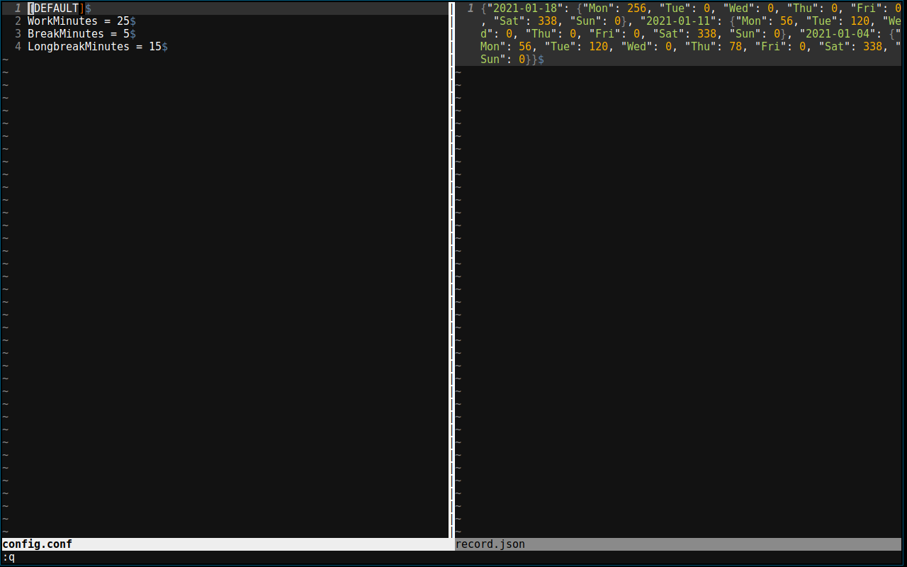

# lazyman-pomodoro
A CLI pomorodo clock on Linux based on Python 3 and ncurses. It supports pause, simple statistics, and configurable session lengths.

## Why does this exist?
I need a very simple pomodoro clock without any arguments to remember, yet it must support things I mentioned earlier.

## What do you need?
- Linux
- Python3
- Zenity
- Recommended
	- [xnotify](https://github.com/phillbush/xnotify). I use together with Zenity since Zenity doesn't pop up to current workspace in my dwm window manager. Feel free to uncommented the line in the script with xnotify.
	- Sound or text-to-speech packages for stronger notification.

## How to use
1. It's just one file. Simple to use.
2. Execute once and exit. It will generate a default configuration and a record in ~/.local/share/lazyman-pomodoro/. After that, feel free to configure as you like.
3. chmod +x lazyman-pomodoro.py. Feel free to add this script to your PATH.

## Screenshots

