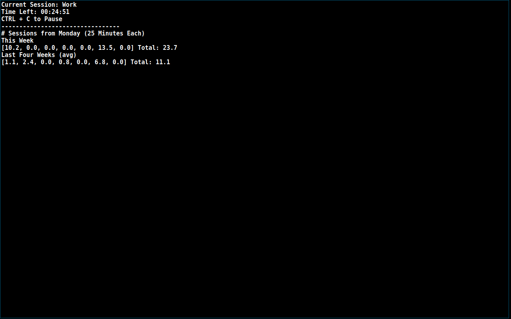

# lazyman-pomodoro

A CLI pomorodo clock on Linux based on Python 3 and ncurses. Support pause, simple statistic, and configurable session lengths.

## Why does this exist?

I need a very simple pomodoro clock without an arguments to rememeber, yet support things I mentioned earlier.

## What do you need?

- Linux
- Python3
- Zenity
- [xnotify](https://github.com/phillbush/xnotify). I use together with Zenity since Zenity doesn't pop up to current workspace in dwm window manager. You may feel free to remove one line of code with xnotify if you like. It doesn't affect any functionalities.
- It may be a good idea to add text-to-speech packages like festival if you like. 

## How to use

1. It's just one file. Very easy to use.
2. Execute once and exit. It will generate a default configuration and a record in ~/.local/share/lazyman-pomodoro/. After that, feel free to configure as you like.
3. chmod +x lazyman-pomodoro.py. Feel free to add this script to your PATH.

## Screenshots

